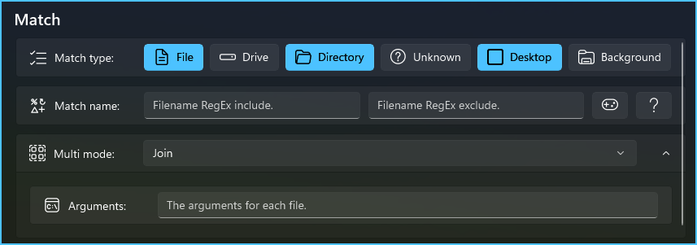

# User Context Menu

Create custom commands in the [modern context menu][contextmenu] and enable/disable commands from other apps.

<p align="center">
   <br/> <br/>
  <a href="https://github.com/flipeador/user-context-menu/releases/download/v1.0.1/package.x64.7z">
    
  </a>
</p>

> [!NOTE]
> - An application can only register a single root command in the modern context menu.
> - Subcommands which themselves have subcommands are not [yet?] supported by Windows Explorer.
>
> This app already supports separators and submenus within submenus; in case support is added in the future.

## Installation

1. Download the latest version from the [Releases][releases] page.
2. Unzip the downloaded file and execute `Install.ps1`.

> [!NOTE]
> During installation:
> 1. If the Windows settings opens, enable [Developer Mode][devmode] before continuing.
> 2. Confirm the installation of the digital certificate when prompted.
>
> After installation:
> - You may need to restart Windows Explorer for the commands to appear. [^1]
>
> If you get an error, make sure you have the following installed:
> - [Microsoft .NET 9 runtimes][netrt].
> - [Microsoft Visual C++ Redistributable][mvcpp].

> [!TIP]
> You can easily check the latest version from within the application:
> - The current version is right below the preview image on this page.
> - The version of the app you have installed is displayed in the window [title bar][titlebar].
> - The app includes a [WebView][webview], used for quick help and to navigate to this page.

## Documentation

Below is a brief description of some of the less obvious features.

You can quickly access some help documents directly from within the app.

The configuration is stored in the local folder; there is a button on the UI to open it. \
The `commands.json` file stores all commands; remember to make a backup just in case.

All [file paths][fpathfmt] have their environment-variable strings [expanded][expenvstr] for the current user. \
Relative paths are converted to absolute paths by searching the `PATH` environment-variable.

<p align="center">
  
</p>

<details>
<summary><h3>Verbs</h3></summary>

Specifies the action to be performed on the file to execute. \
The set of available verbs depends on the particular file or folder.

A special verb `MsgBox` has been added to make it easy to test your commands. \
Instead of executing the specified file, it will simply display an informational message.

The `RunAs` verb is enforced when the user invokes the command while pressing
<kbd><kbd>CTRL</kbd>+<kbd>SHIFT</kbd></kbd>. [^2]

<https://learn.microsoft.com/en-us/windows/win32/api/shellapi/nf-shellapi-shellexecutew#:~:text=the%20action%20to%20be%20performed>

<https://learn.microsoft.com/en-us/windows/win32/api/shellapi/ns-shellapi-shellexecuteinfow#:~:text=the%20action%20to%20be%20performed>

</details>

<details>
<summary><h3>Variables</h3></summary>

The variables described in the tables below can be specified in some controls.

You can also specify user and system variables; see [`environment-variables-editor`][envvars].

#### General

The background path is empty in locations such as `This PC` and `Quick Access`. \
To display the context menu in these locations, enable `Unknown` in **Match type**.

| Variable | Description |
| --- | --- |
| [`%:LOCAL%`][local] | The app's local data folder path. |
| [`%:INSTALL%`][install] | The app's install folder path. |
| `%:DESKTOP%` | The desktop folder path for the current user. |
| `%:BACKGROUND%` | The location where the menu is invoked. |

#### Command line / Arguments

The following variables are only available in **Command line** and **Arguments**:

| Variable | Description |
| --- | --- |
| [`%:PARENT%`][parent] | The path of the parent path. |
| `%:PATH%` | The path of the file or directory. |
| [`%:NAME%`][name] | The name of the file or directory. |
| [`%:STEM%`][stem] | The filename without the final extension. |
| [`%:EXT%`][ext] | The file extension path component. |

The following are the default values for **Command line** and **Arguments**:

| Command line | Arguments | W. Directory | Multi mode |
| --- | --- | --- | --- |
| `"%:PATH%"` | N/A | ANY | `Off` |
| `%:PATH%` | `"%:PATH%"` | ANY | `Each` |
| `%:PATH%` | `"%:NAME%"` | EMPTY | `Join` |
| `%:PATH%` | `"%:PATH%"` | NOT EMPTY | `Join` |

</details>

<details>
<summary><h3>Match type</h3></summary>

Specifies where the context menu should be displayed.

| Match type | Description |
| --- | --- |
| `File` | The selection consists of one or more files. |
| `Drive` | The selection consists of one or more drives. |
| `Directory` | The selection consists of one or more folders. |
| `Unknown` | Unknown location (e.g. `This PC` and `Quick Access`) |
| `Desktop` | The actual desktop; not displayed in the file explorer.  |
| `Background` | The background directory; no files or folders selected. |

</details>

<details>
<summary><h3>Match name</h3></summary>

Specifies inclusion and exclusion [RegEx][regex] filters on the name of the selected items.

This is especially useful to display the context menu depending on the file extension.

For example, the following regular expression is for images:

```
\.(jpe?g|gif|tiff|a?png|webp|avif|jxl)$
```

</details>

<details>
<summary><h3>Multi mode</h3></summary>

Specifies the behavior when multiple items are selected.

| Mode | Description |
| --- | --- |
| `Off` | Hide the command if `>1` items are selected. |
| `Each` | Execute the file individually for each selected item. |
| `Join` | Execute the file once; items are concatenated with a space. |

The arguments are useful when using the `Join` mode.

For example, if you need to prefix the items with `-f`:

> File: `cmd.exe` \
> Command line: `/k echo %:PATH%` \
> Arguments: `-f "%:NAME%"`
>
> Result for two items: `-f "x.txt" -f "y.txt"`

If `%:PATH%` is enclosed in double quotation marks in the command line, the result will be:

```
"-f "x.txt" -f "y.txt""
```

Therefore, avoid double quotation marks with `%:PATH%` in the command line when using `Each` and `Join` modes .

</details>

> [!CAUTION]
> Do not modify the `commands.json` file in the local folder with a text editor; \
> invalid formatting or incorrect values may cause problems with Windows Explorer.

## Examples

<details>
<summary><h3>Create Hard Link</h3></summary>

| Name | Value |
| --- | --- |
| Icon | `imageres.dll` `-5322` |
| File | `%ComSpec%` |
| Show Window | `Hide` |
| Command line | `/c mklink /h "%:NAME%.hlnk" "%:NAME%"` |
| Match type | `File` |
| Match name | `⠀` `\.(hlnk)$` |

</details>

<details>
<summary><h3>Create Symbolic Link (File)</h3></summary>

| Name | Value |
| --- | --- |
| Icon | `shell32.dll` `-133` |
| File | `%ComSpec%` |
| Show Window | `Hide` |
| Command line | `/c mklink "%:NAME%.slnk" "%:NAME%"` |
| Match type | `File` |
| Match name | `⠀` `\.(slnk)$` |

</details>

<details>
<summary><h3>Create Symbolic Link (Folder)</h3></summary>

| Name | Value |
| --- | --- |
| Icon | `imageres.dll` `-5382` |
| File | `%ComSpec%` |
| Show Window | `Hide` |
| Command line | `/c mklink /d "%:NAME%.slnk" "%:NAME%"` |
| Match type | `Directory` |
| Match name | `⠀` `\.(slnk)$` |

</details>

<details>
<summary><h3>Scan with Windows Defender</h3></summary>

| Name | Value |
| --- | --- |
| File | `%ComSpec%` |
| Command line | `/k call "%ProgramFiles%\Windows Defender\MpCmdRun.exe" -Scan -ScanType 3 -File "%:PATH%" -DisableRemediation` |
| Match type | `File` `Directory` |

</details>

## Build

Stack: [WinUI][winui] 3, [.NET 9][net9] (C#), C++23.

Enable [Developer Mode][devmode] on your system if you haven't already done so.

Install [Visual Studio][vs] 2022; add the workloads and components required for [developing with WinUI][winuigs] & C++.

[Download][downl] or [clone][clone] this repository to your local computer, open [`UserContextMenu.sln`](src/UserContextMenu.sln) with Visual Studio.

Create a self-signed certificate for app package [signing][signing]:
1. Open [`Package.appxmanifest`](src/UserContextMenuApp/Package.Release.appxmanifest) from the [Solution Explorer][solexpl] in Visual Studio.
2. Go to the **Packaging** tab, click **Choose Certificate**, then click **Create...**
3. Follow the instructions; save the `PFX` certificate and make sure it is selected.

Install the [NuGet packages](src/UserContextMenuApp/UserContextMenuApp.csproj) for the `UserContextMenuApp` project:
> Visual Studio → Tools → Options… → NuGet Package Manager \
> Package Restore
> - [x] Allow NuGet to download missing packages.
> - [x] Automatically check for missing packages during build.

Select the **Release** configuration, right click the `UserContextMenuApp` project and **Pack** it.

[^1]: <https://learn.microsoft.com/windows/apps/desktop/modernize/integrate-packaged-app-with-file-explorer#restart-file-explorer>
[^2]: <https://windowslatest.com/2024/10/29/windows-11-ctrl-shift-can-now-open-start-taskbar-jump-list-items-as-admins>

<!-- Reference Links -->
[vs]: https://visualstudio.microsoft.com
[net9]: https://dotnet.microsoft.com/download/dotnet/9.0
[netrt]: https://learn.microsoft.com/en-us/dotnet/core/install/windows#install-the-runtime
[mvcpp]: https://learn.microsoft.com/en-us/cpp/windows/latest-supported-vc-redist#latest-microsoft-visual-c-redistributable-version
[envvars]: https://github.com/flipeador/environment-variables-editor
[releases]: https://github.com/flipeador/user-context-menu/releases

[regex]: https://regular-expressions.info
[parent]: https://en.cppreference.com/w/cpp/filesystem/path/parent_path.html
[name]: https://en.cppreference.com/w/cpp/filesystem/path/filename.html
[stem]: https://en.cppreference.com/w/cpp/filesystem/path/stem.html
[ext]: https://en.cppreference.com/w/cpp/filesystem/path/extension.html

[winui]: https://github.com/Microsoft/microsoft-ui-xaml
[winuigs]: https://learn.microsoft.com/windows/apps/get-started/start-here
[signing]: https://learn.microsoft.com/windows/msix/package/create-certificate-package-signing
[solexpl]: https://learn.microsoft.com/visualstudio/ide/use-solution-explorer
[devmode]: https://learn.microsoft.com/windows/apps/get-started/enable-your-device-for-development
[webview]: https://learn.microsoft.com/en-us/windows/winui/api/microsoft.ui.xaml.controls.webview2
[titlebar]: https://learn.microsoft.com/windows/windows-app-sdk/api/winrt/microsoft.ui.xaml.controls.titlebar
[fpathfmt]: https://learn.microsoft.com/dotnet/standard/io/file-path-formats
[expenvstr]: https://learn.microsoft.com/windows/win32/api/processenv/nf-processenv-expandenvironmentstringsw
[contextmenu]: https://learn.microsoft.com/windows/apps/get-started/make-apps-great-for-windows#context-menus

[local]: https://learn.microsoft.com/uwp/api/windows.storage.applicationdata.localfolder
[install]: https://learn.microsoft.com/uwp/api/windows.applicationmodel.package.installedlocation

[downl]: https://github.com/flipeador/user-context-menu/archive/refs/heads/main.zip
[clone]: https://docs.github.com/en/repositories/creating-and-managing-repositories/cloning-a-repository
